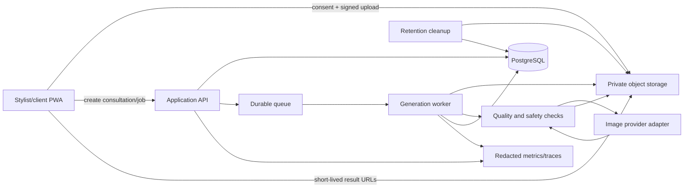

# Technical architecture

**Status:** proposed baseline; provider and masking choices remain gated by the benchmark  
**Architecture goal:** deliver a private, resilient, mobile consultation while keeping image vendors replaceable

## Recommended product shape

Start with a responsive, installable PWA. It opens from a link, can use phone and tablet cameras over HTTPS with permission, and lets the team validate the product before maintaining separate iOS and Android clients. Generation remains online; the app shell, form state, and completed-result metadata can tolerate brief connectivity loss.

Use a small TypeScript workspace when implementation begins:

```text
apps/
  web/                 # PWA, stylist UI, guest flow, admin, thin application API
  worker/              # generation, retry, moderation, cleanup jobs
packages/
  domain/              # consultation and job state machines
  ai/                  # provider adapters, prompt/spec construction
  db/                  # schema, migrations, repositories, access-policy tests
  ui/                  # components and design tokens
  observability/       # redacted logs, traces, metrics
  config/
tests/
  e2e/
  integration/
  evals/
  fixtures/            # synthetic, licensed, or explicitly consented assets only
docs/
ops/
infra/
```

Use a simple workspace manager first. Add heavier monorepo tooling only if coordination or build performance requires it.

## System view



### Application

- **Web:** Next.js-style server-rendered PWA with TypeScript, responsive camera/upload flow, accessible controls, and an authenticated salon area.
- **API:** server-only endpoints for consultation state, signed uploads, job control, feedback, sharing, and deletion. Provider keys never reach the browser.
- **Database:** PostgreSQL for salon, stylist, consultation, consent receipt, structured look, generation job, result, feedback, share, and audit metadata.
- **Storage:** private object storage with tenant isolation, short-lived signed URLs, and lifecycle rules. A managed Postgres/auth/storage platform is reasonable for the pilot, but domain logic must not depend on it.
- **Queue/worker:** durable asynchronous jobs for generation, retries, moderation outcomes, partial success, and deletion. A browser request must not hold open for the full model call.
- **Observability:** correlation IDs, redacted structured logs, distributed traces, product funnel events, quality metrics, and cost usage. Do not record customer content.

## Consultation and generation states

Consultation state is separate from each generation attempt. This lets the UI preserve successful variants when another fails.

```text
consultation: draft -> consented -> ready -> generating -> reviewing -> agreed -> deleted|expired
job:          uploading -> queued -> running -> succeeded|failed|canceled -> expired
```

Every paid generation request uses an idempotency key based on consultation, variant, and prompt version. Retries reuse the logical job and cannot silently create duplicate charges. Each variant publishes progress and result state independently.

## AI pipeline

### 1. Consent and guided capture

- The MVP is for adults only.
- Require exactly one consenting subject in a front-facing or slight three-quarter image, with a visible hairline, usable lighting, and no severe blur or obstruction.
- If the stylist controls the device, the client should personally acknowledge the consent screen.
- Crop/compress before upload where practical, then decode and re-encode server-side to strip EXIF, location, and unexpected payloads.
- Use detection only for quality and safety. Do not identify the person or infer age, ethnicity, attractiveness, emotion, health, or other sensitive traits.

### 2. Structured look specification

Normalize chips, text, and references into versioned fields:

```text
length, silhouette, layers, part, fringe, texture/curl pattern,
volume, fade/taper, base color, tone, highlight placement, finish,
maintenance tolerance, must-preserve details, negative constraints
```

If a user enters a celebrity or character, translate the request into visible hair attributes and show the structured description for confirmation. Send those attributes to the image model. Never request the reference person's face or identity.

### 3. Provider-neutral edit

Implement one interface for image editing so the benchmark can compare providers without changing the product:

```ts
interface HairstyleImageProvider {
  edit(request: HairstyleEditRequest): Promise<HairstyleEditResult>;
}
```

The request includes a source portrait, optional hair-style reference, structured specification, optional mask, quality profile, idempotency key, and prompt version. The result includes image bytes, provider/model version, usage, timing, moderation state, and provenance metadata when available.

As of 2026-09-25, the first candidate is OpenAI GPT Image 2.5 Sunburst because official guidance positions it for precise editing and subject preservation. GPT Image 2.5 Flare is the speed challenger. Both support current image editing workflows; quality, latency, and cost must be measured on the project's own test set rather than inferred from model marketing. [OpenAI image prompting](https://developers.openai.com/api/docs/guides/image-prompting) [OpenAI image generation](https://developers.openai.com/api/docs/guides/image-generation)

Use the direct Images edit endpoint for the first stateless workflow. Re-evaluate a conversational image workflow only if multi-turn context materially improves refinement without weakening deletion guarantees.

### 4. Masking experiments

The technical spike must compare three strategies on identical inputs:

1. constrained prompt with source and optional reference;
2. editable hair/growth-corridor mask plus protected face, clothing, and background;
3. masked edit followed by careful protected-region recompositing.

On-device hair/person segmentation is a candidate for privacy and latency. MediaPipe exposes hair and multiclass person segmentation, but benchmark quality on fades, bangs, ears, long hair, curly/coily hair, locs, braids, head coverings, and growth beyond the current silhouette. [MediaPipe Image Segmenter](https://developers.google.com/edge/mediapipe/solutions/vision/image_segmenter)

Masks are guidance rather than guaranteed pixel boundaries in current generative editing. If a mask or recomposite creates halos, hard seams, or prevents plausible long-hair growth, the benchmark should reject the strategy. Offer a manual brush only if automatic masks fail often enough to justify the extra consultation time.

### 5. Prompt contract

Keep the prompt built from versioned templates and structured data. The core contract is:

- change only the hair requested;
- preserve face geometry, skin tone, expression, age appearance, body, clothing, pose, background, lighting, and camera properties;
- use a secondary reference only for cut, color, texture, and silhouette;
- do not beautify, retouch, add makeup/accessories/text/logos, or transfer identity.

Test prompt versions as code. Do not log the raw assembled prompt in production because it can contain user text.

### 6. Automated checks and output

Before display, check decode/dimensions, single subject, gross safety, obvious corruption, and change outside protected regions. Perceptual or structural checks can trigger a retry, but automated similarity alone cannot approve an identity-sensitive result.

Preserve model provenance metadata when present. Add a visible **AI hairstyle preview — actual results vary** label to shared/downloaded assets and a persistent label in the UI. Record provider, model snapshot, prompt version, mask strategy, and generation settings as non-content metadata for regression diagnosis.

## Data lifecycle

Initial conservative policy, pending legal/privacy review:

| Data | Default lifecycle |
|---|---|
| Consent receipt and policy version | Keep as required for accountability; no portrait embedded |
| Original portrait | Delete after final generation and validation; hard maximum 24 hours for retryable failures |
| Temporary masks and derivatives | Delete with the original or sooner |
| Unsaved generated previews | Delete within 24 hours |
| Explicitly saved consultation image | Delete after 30 days unless a shorter salon setting applies |
| Structured look and service notes | Same as saved consultation; separate from portrait where possible |
| Operational logs and aggregate metrics | No customer content; duration set by security/operations policy |

Deletion must remove database references, storage objects, derived thumbnails, masks, queued work, and active share links. A cleanup job verifies deletion and alerts on lag. The UI provides immediate deletion from the consultation screen.

OpenAI currently documents the Images endpoint as eligible for Zero Data Retention for supported image models, while noting that input images are safety-scanned and certain flagged content can be retained for review. Treat provider controls and contracts as deployment prerequisites, not assumptions. [OpenAI data controls](https://developers.openai.com/api/docs/guides/your-data)

## Security and privacy design

- Encrypt transport and storage; use private buckets, tenant-scoped authorization, and short-lived signed URLs.
- Keep provider and storage credentials on the server and rotate through the hosting secret manager.
- Apply strict file type, size, decode, and pixel-count limits. Re-encode every upload.
- Rate-limit by account, salon, device/session, and IP signals without creating covert identity profiles.
- Use role-based access, database tenant policies, and tests that attempt cross-tenant reads and deletes.
- Avoid face recognition, persistent face embeddings, or reusable biometric templates.
- Do not place client photos in source control, CI, preview deployments, support tools, error reports, or analytics.
- Maintain a subprocessor/data map, retention policy, incident response, deletion runbook, and adult-only policy before the pilot.
- Moderate text and image inputs and outputs, but do not mistake general moderation for complete child-safety detection.

## Observability

Collect only what supports reliability and product decisions:

- funnel: consent, capture, upload, generation, comparison, agreement, share, delete;
- job: queue age, run time, retry, partial success, cancellation, policy rejection, error class;
- quality: human scores by transformation and sufficiently sized cohort;
- economics: input/output usage, cost per attempt, cost per successful batch, cost per agreed consultation;
- privacy: deletion lag, expired links, cross-tenant access denials, orphaned objects;
- release: app version, provider adapter version, model snapshot, prompt version, mask strategy, feature flags.

Never log photos, client names, original filenames, raw prompts, signed URLs, authorization headers, or model credentials.

## Open decisions after the technical spike

- Whether Sunburst, Flare, or a challenger wins the quality/cost/latency gate
- Whether masking improves enough to keep and whether manual correction is necessary
- Whether three variants provide enough choice or four materially improve usefulness
- Which managed database/auth/storage and queue services best fit the pilot region and budget
- Whether saved consultations should contain images, only a client-controlled download, or both
- Whether a native camera shell becomes worthwhile after measured PWA use
