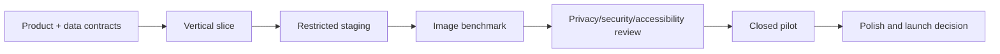

# Delivery roadmap

**Planning assumption:** one product-minded engineer using agentic support, with part-time design/privacy input and access to practicing stylists for research and evaluation  
**Schedule rule:** time ranges guide sequencing; evidence gates decide when the project advances

## Recommended sequence

| Stage | Indicative effort | Deliverables | Exit criteria |
|---|---:|---|---|
| 0. Product and risk definition | 3–5 focused days | Product brief, workflow, non-goals, consent/data map, risk register, evaluation rubric, provider spike plan, provisional economics | One primary use case; adult-only policy; initial benchmark assets identified; retention and success hypotheses recorded |
| 1. Technical prototype | 1–2 weeks | Capture/upload, structured hair request, provider adapter, prompt/mask experiments, deterministic eval runner, result comparison | One pipeline clears the prototype gate in `QUALITY.md`; no full build if it does not |
| 2. UX and service design | Runs beside stages 1–2 | Mobile wireframes, visual direction, capture guidance, consent, progress/error states, comparison, feasibility, sharing/deletion | Five representative users complete the prototype without coaching; every loading, rejection, retry, timeout, cancellation, and deletion state is designed |
| 3. MVP vertical slice | 1–2 weeks | Consent -> capture -> describe -> generate -> compare -> agree -> delete using private test assets and a fake/live provider switch | Critical path works end to end on target phone/tablet browsers; meaningful automated checks pass |
| 4. Pilot-ready MVP | 3–5 additional weeks | Accounts/tenancy, durable jobs, private storage, retention cleanup, feedback, admin support view, telemetry, feature flags, runbooks | Pilot release gates pass; no open P0/P1 defect; privacy/security/accessibility review complete |
| 5. Closed pilot | 4–6 weeks | 2–5 salons initially, onboarding, support, dashboards, weekly quality/cost review, controlled experiments | At least 100 consultations; usefulness, latency, cost, retention, and repeat-use gates met; partners choose to continue |
| 6. Polished product | 6–12 weeks after pilot signal | Refined design system, salon admin, billing if justified, localization groundwork, provider fallback, incident/support operations, API/connector foundation | Four weeks at service target; security/privacy/legal review; restore and rollback rehearsal; support and launch operations ready |

## Workstreams and dependencies

### Discovery work that can run in parallel

1. **Salon workflow research:** observe consultations, choose wording and controls, validate willingness to adopt/pay.
2. **Image-quality benchmark:** assemble permitted assets, build rubric, compare provider/prompt/mask strategies.
3. **UX design:** create the capture, describe, progress, compare, feasibility, and delete flows.
4. **Privacy and safety:** data map, consent, adult-only rules, subprocessor review, threat model, retention and incident plan.
5. **Economics:** cost per generation, retry rate, cost per useful result, expected consultations per stylist, provisional pricing envelope.

The benchmark and user-flow work converge before the MVP contract is frozen.

### Build work that can run in parallel after contracts exist

1. Camera/capture and consultation UI
2. Generation worker, queue state machine, and provider adapter
3. Database, tenancy, storage authorization, consent, and retention cleanup
4. Test/evaluation harness and permitted fixtures
5. Observability, feature flags, environments, and deployment foundation

Integration stays sequential:

## First implementation wave

The dependency-ordered backlog is:

1. Finalize the product brief, initial metrics, and explicit non-goals.
2. Write the data map, consent copy, retention proposal, threat model, and adult-only policy.
3. Define benchmark asset provenance and the stylist scoring rubric.
4. Scaffold the evaluation harness and deterministic fake provider.
5. Run provider, prompt, mask, and protected-region bake-offs.
6. Create and test the mobile consultation wireframe with practicing stylists.
7. Record provider, storage, queue, analytics, and tenancy decisions.
8. Scaffold the PWA, worker, shared domain, CI, and preview environment.
9. Build the complete capture -> generate -> compare -> delete vertical slice.
10. Add durable jobs, auth/tenancy, private storage, cleanup, moderation, and redacted telemetry.
11. Run software, image-quality, privacy, security, and accessibility gates.
12. Deploy a restricted pilot only after the gate review.
13. Use pilot evidence to choose deeper model work, native apps, booking/CRM connectors, and pricing.

## Design plan

### Low-fidelity first

Create a phone-sized clickable flow using realistic copy and all error states. Test task completion before visual polish. The minimum screens are:

- new consultation and client handoff;
- concise consent/retention;
- guided capture and retake feedback;
- structured hair controls and reference upload;
- structured-look confirmation;
- per-variant generation progress and partial retry;
- original/result comparison and refinement;
- stylist feasibility and service notes;
- share/download/delete confirmation.

### Visual direction

Use warm neutral backgrounds, deep charcoal text, one restrained accent color, large edge-to-edge photography, and high-contrast controls that remain usable in salon lighting. Avoid neon gradients, robotic copy, or visual effects that make the tool feel like entertainment. Typography and touch targets should favor quick shared use at arm's length.

### Research cadence

- First five usability sessions on the low-fidelity flow
- Five more on the interactive vertical slice
- Weekly pilot review of observed friction, failed inputs, abandoned states, and support requests
- Separate review with stylists experienced in curly/coily hair and protective styles
- Do not use the same participants as the only image-quality graders and usability subjects

## Software plan

Build one walking skeleton before distributing effort widely. It should use a fake provider in development and a controlled live provider in restricted staging. The slice proves the state model, privacy boundary, job lifecycle, comparison UI, and deletion behavior.

Then harden in this order:

1. idempotent jobs and partial-result recovery;
2. private uploads, tenant access policies, and retention cleanup;
3. prompt/spec versioning and provider switching;
4. feedback, cost, latency, and quality telemetry;
5. support tooling and feature flags;
6. performance, accessibility, browser reliability, and failure recovery;
7. share/export with visible AI labeling;
8. salon administration and billing only after pilot demand.

## Testing plan

Routine CI uses the deterministic fake provider. Live image calls run in controlled staging after changes to provider, model, prompt, mask, or quality settings. Test the critical path, each state transition, cross-tenant access, deletion cascade, expired links, duplicate callbacks, worker crashes, rate limits, partial success, corrupt media, and accessibility.

Image evaluation is its own release surface. Use human stylist scoring plus automated regression signals and report results by meaningful cohort. The detailed methods and thresholds live in `QUALITY.md`.

## Environments

1. **Local:** synthetic/permitted fixtures, fake provider by default.
2. **Per-change preview:** fake provider only; no production data or provider secrets.
3. **Restricted staging:** permitted benchmark assets, live-provider smoke and eval runs, spend limits.
4. **Pilot production:** invited salons, feature flags, kill switch, private storage, full monitoring and retention enforcement.

## Release decision points

### After technical prototype

- Continue if identity preservation and instruction adherence make results useful.
- Narrow the use case if color-only or particular styles pass while broad transformations do not.
- Stop or change the model approach if no configuration meets the minimum gate.

### After closed pilot

- Build native only if measured PWA camera, backgrounding, offline, or distribution problems materially hurt use.
- Build connectors/API only after salons identify the booking/CRM handoff that saves enough time.
- Build custom/self-hosted inference only if vendor quality, control, privacy terms, latency, or economics block the validated workflow.
- Add minors only after guardian consent, age assurance, child-safety, legal, and zero-retention requirements are explicitly approved.

## Definition of polished

“Polished” means more than attractive screens. The product:

- consistently completes the consultation on target devices;
- preserves identity and performs fairly across measured cohorts;
- recovers clearly from poor photos, policy rejection, timeouts, partial failure, and provider outage;
- makes privacy, deletion, and AI provenance visible and trustworthy;
- gives the stylist a useful agreed plan, not only an image;
- provides support, incident, rollback, retention, and deletion operations;
- meets accessibility, security, legal, reliability, and unit-economics gates.

## Product choices deferred on purpose

- final brand/name and trademark work;
- subscription versus per-consultation pricing;
- exact cloud vendors and deployment region;
- number of preview variants beyond the initial test;
- native app, live AR, multi-angle/3D, client history, and salon connectors;
- proprietary or self-hosted image models.

These decisions should follow evidence rather than become prerequisites for proving the core value.
