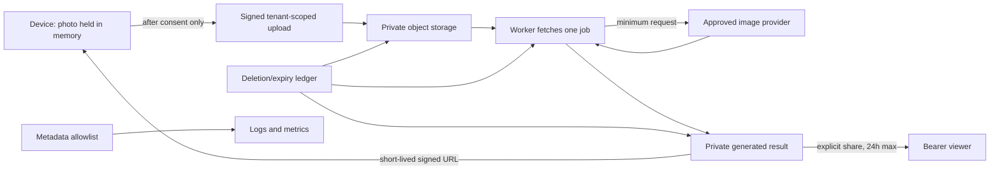

# MVP data map

**Status:** normative discovery contract for implementation and pilot review  
**Applies to:** the adult-only hAIr PWA, application API, workers, storage, sharing, telemetry, and support  
**Owner:** product/privacy owner; every schema, event, vendor, and retention change must be reconciled here before release

This document is the allowlist for MVP data collection. If a datum is not listed here, the product must not collect or persist it until this map, the client disclosure, and the deletion contract are updated. The map applies to source portraits, reference images, and generated likenesses as sensitive personal data even if a jurisdiction would not classify every image as biometric data.

## Fixed product rules

- No image bytes leave the device before the pictured client personally acknowledges the current consent screen.
- The MVP has no client account and does not ask for a client name, email address, phone number, birthday, demographic traits, or medical history.
- hAIr does not perform identification, authentication by face, face search, persistent face embeddings, demographic inference, attractiveness scoring, or diagnosis.
- Customer content is never used by hAIr for model training, product-model fine-tuning, advertising, or sale.
- Customer content never enters source control, normal CI, preview deployments, analytics tools, logs, traces, error reports, or a support ticket.
- The browser must not put portraits, references, masks, or previews in a service-worker cache, HTTP cache, `localStorage`, or persistent IndexedDB. Sensitive responses use `Cache-Control: no-store`.
- Client-facing downloads leave hAIr's control. The UI must say so before download.
- The earliest of a user deletion request, tenant/account deletion, consent withdrawal, and the retention deadline controls deletion.

The working role allocation is: the salon decides why a client consultation occurs and is the controller/business; hAIr processes consultation content for the salon as processor/service provider; image, hosting, and infrastructure vendors are subprocessors. hAIr separately determines limited processing for account security and platform operations. This allocation is provisional until the launch region, contracts, and privacy review are fixed; consent is a product requirement and must not be treated as a substitute for determining every applicable legal basis.

## System locations and access roles

| Code | Location | Required boundary |
|---|---|---|
| D | Client/stylist device | In-memory preview only for sensitive media; no persistent browser cache; OS/browser permissions govern camera access. |
| DB | Primary application database | Encrypted; tenant-scoped row policy; content fields separated from audit/operational fields. |
| OS | Private object storage | Non-public bucket; tenant-prefixed opaque object keys; short-lived, purpose-bound signed access only. |
| Q | Durable queue/worker | IDs and minimal job parameters only; image bytes are fetched just in time; payloads encrypted and redacted from inspection UIs. |
| AI | Selected image provider | Server-to-server, stateless edit endpoint under approved retention/data-use terms; only the minimum source/reference/spec needed for the edit. |
| TM | Metrics, logs, and traces | Metadata allowlist only; no customer content or reusable signed URLs. |
| SP | Restricted support/security system | Tickets and operational metadata only; content requires a separately approved, time-limited break-glass flow. |
| BK | Encrypted backups | Isolated, access-logged, no normal application access; deletion ledger is replayed after any restore. |

Application access roles are: **client session** (its one consultation), **stylist** (only consultations they created or were explicitly assigned), **salon admin** (membership/configuration and deletion metadata; no portrait access unless explicitly assigned as a stylist), **worker service** (one claimed job), **privacy/support operator** (metadata by default), and **security break-glass operator** (time-limited, reasoned, audited access). A salon handoff must create an explicit, auditable assignment rather than granting every tenant member access. Infrastructure/vendor staff access is controlled by vendor contract and least privilege. No hAIr employee or salon user receives global browse access to portraits.

## Data inventory and lifecycle

Retention is measured from the event stated in each row. “Delete” means the cascade in [`DELETION-CONTRACT.md`](DELETION-CONTRACT.md), including derivatives, shares, queue work, and restore protection.

| ID | Data class and examples | Purpose | Location | Access | Default retention | Deletion path |
|---|---|---|---|---|---|---|
| A-01 | Salon profile: business name, contact, locale, logo, brand settings | Identify and brand the salon workspace | DB, OS for logo, BK | Salon admin; hAIr account/support metadata | Account life; purge within 30 days of account closure | Account cascade; logo object, rows, cached branding, then backup expiry |
| A-02 | Stylist account: name, work email, auth-provider subject, account status | Authenticate staff and attribute professional decisions | Auth service, DB, BK | The stylist, salon admin, restricted support | Account life; disabled immediately on removal; purge within 30 days unless required security records remain | Auth-provider deletion plus DB/account cascade |
| A-03 | Membership and role records | Enforce salon and role boundaries | DB, TM security audit, BK | Stylist for own membership; salon admin; security | Active membership plus 90 days of audit evidence | Membership deleted/anonymized; audit event retained to its deadline |
| A-04 | Salon retention setting and policy acceptance | Apply a shorter salon-selected deadline and prove configuration | DB, BK | Salon admin; privacy/support metadata | Current value plus 24 months of change history | Account cascade or policy-record expiry |
| S-01 | Auth/session cookies and anti-CSRF token | Maintain secure signed-in or guest session | D, auth service | Current browser/session and auth service | Session cookie at logout/expiry; guest consultation token no longer than consultation retention | Revoke session/token; clear client storage |
| S-02 | Guest client control token and capture QR token | Let the client upload/view/delete only their consultation | D, one-way token digest in DB | Client session; API validates digest | Capture token 15 minutes; control token until consultation expiry/deletion | Revoke digest immediately; browser clears token |
| S-03 | Signed upload/media authorization: opaque object scope, method, limits, expiry, signature | Permit one bounded upload or private media fetch without exposing storage credentials | Generated transiently by API; D; validated at OS edge | Authorized client session and object-storage validator | Upload/media grant no more than 5 minutes; never persisted in logs, analytics, or database | Natural cryptographic expiry plus object/consultation deletion; stop issuing grants at expiry/deletion and purge any cached response |
| C-01 | Device source capture/selection and volatile comparison copy | Let the client review/crop before consent and compare the original with results during the current uninterrupted browser session | D only | Person holding the device | Memory only; clear on decline, retake, completed comparison, delete, leaving the consultation, reload, or tab/process termination. Never persist it. | Revoke object URL and release all application references; no network request before consent. Reload intentionally loses original comparison after the server source has been purged |
| C-02 | Normalized server source portrait | Create hairstyle previews and support retryable generation | OS; transient worker/AI memory | Client session while source exists; authorized salon users; claimed worker; approved AI provider | Delete after the final live generation/validation completes; retain only for retry, never beyond 24 hours from upload | Consultation cascade or source-expiry job; delete object, temporary replicas, signed URLs, and provider state if any |
| C-03 | User-supplied inspiration image | Supply hair attributes, color, texture, or silhouette | D before upload; OS; transient worker/AI memory | Same as source portrait | Device selection is memory-only and clears after upload/decline/retake; server/provider copies delete after final live generation/validation with a hard maximum of 24 hours from upload | Same as C-02; revoke the local object URL after upload and use no public URL or image-search cache |
| C-04 | Upload normalization output and quality/safety findings: dimensions, file type, “single subject,” blur/lighting flags, moderation state | Reject unsafe/unusable media before paid generation | DB for bounded categorical result; transient worker memory | Client/stylist for actionable result; worker; security metadata | Categorical result follows consultation: 24 hours unsaved or 30 days saved; decoded buffers destroyed after request | Consultation cascade; buffer/process cleanup |
| C-05 | Temporary masks, crops, thumbnails, protected-region maps, and other image derivatives | Guide editing and render efficient previews | OS; transient D/worker memory | Same as corresponding source/result | Masks/crops: source deadline; result thumbnails: corresponding result deadline | Object-manifest cascade; orphan scan verifies no derivative remains |
| C-06 | Structured hair request: length, color family/tone, texture, fringe, part, finish, maintenance tolerance, preserve constraints | Build a controlled edit and service brief | DB, Q by ID, transient AI request, BK | Client session; authorized salon users; worker/provider minimum | Unsaved: until the consultation deadline, no later than 24 hours from consultation creation; explicitly saved: 30 days from save or shorter salon setting | Consultation cascade; provider state deletion/expiry |
| C-07 | User-entered text and inspiration label, including a celebrity/character name before conversion | Capture intent and convert it into visible hair attributes | D, DB while consultation is active; transient worker/AI request | Client/stylist; worker/provider minimum | Raw celebrity/character name is discarded after the client confirms the neutral attribute summary; other free text follows consultation retention | Field erasure at normalization or consultation cascade; never log raw text |
| C-08 | Assembled model prompt | Instruct the selected provider | Worker memory and transient AI request only | Claimed worker and provider | Request lifetime only; never stored by hAIr | Release memory after call; provider must meet approved no-training/retention contract |
| C-09 | Consent receipt: consent version, disclosure version, UTC timestamp, purpose code, salon ID, consultation/session ID, acknowledgement method, adult self-attestation, reference attestation when applicable | Prove the client saw and accepted the correct terms | DB, BK | Client can view current receipt; salon privacy admin; restricted privacy/support | 24 months after consultation deletion/expiry, provisional pending regional legal review; contains no image, client name, raw prompt, or device fingerprint | Delete or irreversibly detach at deadline; earlier verified privacy request unless retention is legally required |
| C-09a | Separate save receipt: consultation ID, disclosure version, save choice, UTC timestamp, computed access-expiry time | Prove the client deliberately changed selected previews/plan from unsaved to saved retention | DB, BK | Client session; salon privacy admin; restricted privacy/support | Same 24-month accountability period as the consent receipt; no image, notes, raw prompt, or client identity | Delete or irreversibly detach at deadline; earlier verified privacy request unless retention is legally required |
| C-10 | Consultation record: opaque ID, salon ID, state, timestamps, selected result IDs, expiry time | Coordinate workflow, authorization, and retention | DB, BK | Client session; authorized salon users; services scoped to object | Unsaved: no later than 24 hours from consultation creation; explicitly saved: 30 days from save or shorter salon setting | Tombstone then consultation cascade; minimal deletion receipt replaces content row |
| C-11 | Provider request content: source/reference images and structured request | Generate and safety-check a preview | AI, in transit from worker | Provider systems under approved project and contract | Must use a stateless endpoint and approved Zero Data Retention/equivalent where available. Any provider exception and maximum must be disclosed before pilot | Provider endpoint/contract deletion; hAIr deletes any provider object ID. A provider that cannot satisfy the deployment contract is ineligible |
| C-12 | Generated preview, variant, and thumbnail | Show and compare the proposed hairstyle | OS; transient D; AI only during response | Client session; authorized salon users; share viewers for explicitly shared result | Unsaved: until the consultation deadline, no later than 24 hours from consultation creation. Explicitly saved: 30 days from save or shorter salon setting | Result/consultation cascade; revoke all signed/share access first |
| C-13 | Favorite, feasibility state, service and maintenance notes | Record the stylist-approved plan | DB, BK; included in explicit download/share artifact | Client session; authorized salon users; explicit share viewer | Unsaved: until the consultation deadline, no later than 24 hours from consultation creation; explicitly saved: 30 days from save or shorter salon setting | Consultation cascade; downloaded copy is outside hAIr control |
| C-14 | Client feedback and problem category, excluding free-form customer content | Measure consultation usefulness and failure modes | DB or approved analytics as categorical event | Authorized salon aggregate; product/quality team | Row-level/pseudonymous 90 days; aggregate thereafter only if re-identification is not reasonably possible | Consultation link removed on deletion; row expires at 90 days; aggregate has no consultation/user key |
| G-01 | Generation job/variant state, retry count, idempotency key, timestamps, cancel reason, error class | Run reliable asynchronous generation and recover partial results | DB, Q, TM, BK | Client/stylist status; worker; operations metadata | Detailed job follows consultation; non-content aggregate may remain | Cancel and remove queue work; delete row/content linkage; keep only aggregate counters |
| G-02 | Provider/model/version, prompt-template version, mask strategy, settings, timing, usage/cost, moderation outcome, provenance metadata | Reproduce regressions, operate service, and account for cost | DB and TM; BK | Product/quality/operations; tenant sees relevant usage summary | Detailed metadata 90 days from event at most; consultation linkage is removed sooner on deletion; tenant/model aggregates up to 13 months | Remove consultation linkage on delete; expire detailed row; retain only non-identifying aggregate |
| H-01 | Share record: one-way token digest, result IDs, created/expiry/revoked times, access count | Provide controlled QR/link viewing | DB; token only in client URL | Creator, intended bearer, API validator | Default 24 hours and never later than underlying consultation expiry; revocation is immediate | Revoke token/digest, purge share cache, delete at consultation cascade |
| H-02 | Branded share/download artifact with visible AI label | Let client take away an agreed service brief | Generated on demand; OS only if share is enabled; recipient device after download | Same as H-01; then recipient controls downloaded copy | Server copy follows H-01/C-12. Browser download is outside hAIr retention control | Delete server object and revoke link; disclosure explains local copies cannot be recalled |
| T-01 | Product funnel event: event name, coarse app version, tenant ID, consultation pseudonym, timestamp | Measure completion and usability without customer content | TM | Product/operations; tenant aggregate | Pseudonymous detail 90 days; non-identifying aggregate up to 13 months | Remove consultation link on deletion; scheduled expiry; no persistent device/user fingerprint |
| T-02 | Redacted logs, traces, and error reports: correlation ID, route, status, duration, error class | Reliability, debugging, incident detection | TM | Operations/security; vendor staff per contract | 30 days; raw log retention is not extended for a case | Time-based deletion; targeted purge by correlation ID; redaction tests block forbidden fields. Any necessary content-free incident fact is recorded separately in I-01 |
| T-03 | Security/audit event: actor/account/tenant ID, action, object type, allow/deny, timestamp, reason; never image or prompt | Detect abuse and prove access/deletion actions | TM/DB, BK | Security/privacy; salon admin for its own audit subset | 90 days; consent/deletion receipts follow their 24-month rule | Expiry/anonymization; account IDs detached when no longer needed |
| T-04 | Network/rate-limit signal: IP processed at edge, daily keyed IP digest, coarse user agent, counters | Prevent upload abuse, brute force, and cost exhaustion | Edge/security service, TM | Automated control; security on alert | Raw edge record no more than 7 days where vendor configuration permits; keyed digest/counters 30 days; rotate key daily | Vendor TTL and key destruction; never combine into advertising or identity profile |
| I-01 | Security/privacy incident case: case ID, affected tenant/opaque scope, category, detection/notice/closure times, decisions, remediation, notification status; no customer content | Investigate and document a security/privacy event without extending raw content/log retention | Restricted security/privacy case system, audit, BK | Named incident, privacy, and legal responders | 24 months after closure, provisional pending launch-region and insurance/contract review | Scheduled case expiry; detach account/tenant references earlier when no longer needed; legal restriction uses D-03 |
| D-01 | Deletion request/verification receipt: opaque request ID, tenant, initiator role, scope, timestamps, attempts, component outcomes, final status, policy version | Make deletion idempotent, verifiable, and auditable | DB/TM, BK | Requester sees status; privacy/security | 24 months after verified deletion; no customer content or original object key | Scheduled expiry; earlier erasure unless legally required |
| D-02 | Active purge manifest and deletion-status capability: encrypted internal locators, component leases, status-token digest, retry/error class | Let deletion workers find every component and let the requester check progress without content access | DB/queue during purge; status token on D and one-way digest in DB | Deletion worker; scoped status requester; privacy/security metadata | Encrypted locators removed immediately after active-system verification; status capability expires within 30 days; content-free component outcome moves to D-01 | Destroy locator encryption material/rows, revoke token digest, and expire queue leases; never copy locators into D-01/TM |
| D-03 | Exceptional preservation/legal-restriction record: authority/reference, minimal affected scope, approver, start/review/end dates, notice restriction | Document and bound a legally required exception to ordinary erasure | Restricted privacy/legal system, audit, BK | Named privacy/legal and security operators only | Only for the documented legal period; review at least every 90 days; delete immediately when authority expires | Lift restriction, invoke normal cascade for the preserved minimum, then expire the record under applicable legal/accountability policy |
| P-01 | Support request: salon account/contact, category, timestamps, correspondence | Resolve account/product problems | SP | Requester and restricted support | 90 days after closure | Ticket deletion/expiry; customer content attachment is blocked and support instructs sender to remove it. Security/legal facts needed longer move into content-free I-01 or D-03 rather than extending the ticket |
| P-02 | Time-limited break-glass record: approver, operator, reason, scope, start/end, actions | Diagnose a severe incident when metadata is insufficient | SP/TM | Two authorized staff; security/privacy review | 24 months; no copied image bytes in the record | Expiry; any temporary access grant revoked automatically; consultation content follows its normal deadline |
| B-01 | Encrypted database/object backup | Disaster recovery | BK | Backup service and audited restore operators | Maximum 35 days; object versioning is disabled for consultation media unless versions share this maximum | Age out cryptographic/physical copy; every restore replays deletion tombstones before serving traffic |

### Explicit non-collection

The MVP must not add client contact delivery, a client directory, birthday/age, face geometry/embedding, inferred sex/gender/ethnicity/skin tone/health/emotion, location history, contacts, advertising IDs, cross-site trackers, background audio/video, a celebrity image library, or raw support-session replay. Cohort attributes used for the controlled benchmark belong only to the restricted evaluation dataset and are governed by its separate consent/provenance contract, not production inference.

## End-to-end flow

1. The camera/file is held locally. Decline, failed adult attestation, or retake clears it without upload.
2. After consent, the API issues a single-purpose upload authorization bound to tenant, consultation, media class, byte limit, and short expiry.
3. The server decodes and re-encodes allowed media, discards metadata/original filenames, and records only bounded quality/safety categories.
4. A worker reads a minimal job, fetches content just in time, calls the approved provider, validates the response, writes the result, and releases buffers.
5. Results are served only through authorized, short-lived access. A share is a separate explicit action with its own revocable token.
6. User deletion and automatic expiry write the same deletion ledger and invoke the same verified cascade.

## Vendor and region release gate

Before any live-client pilot, the owner must fill a subprocessor register with legal name, function, content received, storage/processing regions, staff access, training use, default and contracted retention, deletion mechanism, incident terms, and contract/DPA evidence. Placeholders in the consent UI must resolve to real names and a real privacy contact.

The chosen AI route must be checked against the provider's current endpoint-level controls, not marketing-level claims. OpenAI's current data-control documentation, for example, distinguishes default abuse-monitoring retention from approved Zero Data Retention, states endpoint/model limitations, and notes that image/file inputs flagged by a CSAM classifier may be kept for manual review even with enhanced controls. These are deployment facts to verify and disclose, not assumptions inherited from a model name: [OpenAI API data controls](https://developers.openai.com/api/docs/guides/your-data).

This map applies data minimization, purpose limitation, and storage limitation as engineering defaults. The official GDPR text is a useful baseline for those principles and for erasure analysis, but launch counsel must assess the selected jurisdictions and actual controller/processor roles: [Regulation (EU) 2016/679, Articles 5 and 17](https://eur-lex.europa.eu/eli/reg/2016/679/oj).

## Change control and verification

A change requires privacy review before merge if it adds a field, vendor, destination, purpose, staff role, client contact method, persistent browser store, training/evaluation use, or longer retention. Increasing retention, changing controller purpose, enabling content review, or adding a provider requires a recorded product decision and updated client disclosure; it may also require fresh consent.

Release evidence must include:

- schema/event inventory matched to every row above;
- an automated negative test proving image bytes and content canaries never appear in telemetry;
- a browser-network test proving no photo/reference request occurs before consent;
- object/row/queue/share/provider deletion verification for each content class;
- configured vendor TTL screenshots or exported settings, DPA/subprocessor records, and provider-retention evidence;
- tenant authorization tests for read, write, share, and delete; and
- backup retention and restore-with-tombstone rehearsal.
