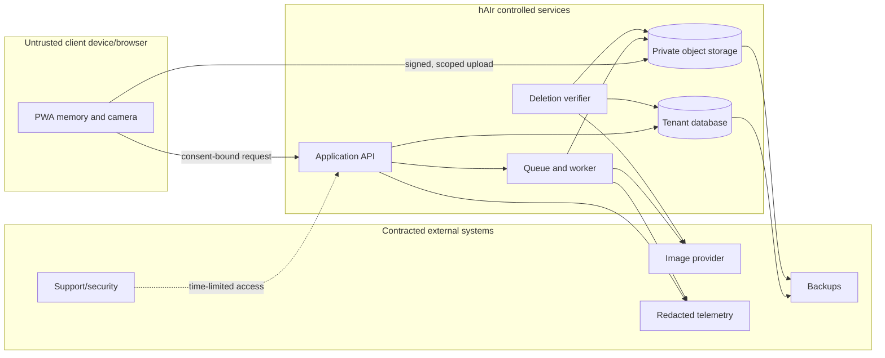

# MVP privacy and security threat model

**Status:** normative discovery threat model; reassess at prototype, pilot, and every material architecture/vendor change  
**Method:** STRIDE plus privacy, safety-abuse, and machine-learning failure analysis  
**Protected outcome:** one consenting adult's portrait and consultation remain private to the intended salon/client, change only for the stated hair-visualization purpose, expire predictably, and cannot reappear after deletion

## Scope and assumptions

In scope: the PWA camera/file flow, consent receipt, signed upload, application API, tenant database, private object storage, job queue/worker, provider request and response, generated results, share/download flow, telemetry, support access, deletion workers, and backups.

Out of scope but tracked as residual risk: a recipient photographing the screen or redistributing a downloaded result; compromise of the user's unlocked device; and salon misuse outside hAIr. The product must warn about those limits and still minimize what an incident exposes.

Assumptions that must be proven before pilot:

- exactly one authenticated tenant owns every consultation object;
- guests receive only random, consultation-scoped capabilities, never tenant-wide access;
- source, reference, generated, and derivative objects are private and addressed by opaque IDs;
- the AI provider is called server-side through an approved stateless endpoint and contract;
- images and raw text never enter logs/analytics/support by default;
- deletion tombstones win over queued work and late provider responses; and
- the adult-only gate and reference attestations in [`CONSENT-AND-DISCLOSURE.md`](CONSENT-AND-DISCLOSURE.md) are enforced.

## Assets, actors, and trust boundaries

### Highest-value assets

1. Source portraits, inspiration images, generated likenesses, masks, crops, and thumbnails.
2. Consent, hairstyle request, feasibility decision, service/maintenance notes, and share state.
3. Tenant membership, authorization policy, guest control tokens, share tokens, signed URLs, and service credentials.
4. Provider prompts/requests and safety outcomes.
5. Deletion tombstones, verification receipts, and audit evidence.
6. Availability and spend: provider quota, queue capacity, and salon workflow continuity.

### Relevant actors

- consenting client; stylist; salon administrator;
- intended or unintended bearer of a share link;
- malicious or careless salon user;
- attacker without an account or with a compromised account/session;
- hAIr support, privacy, security, and infrastructure operator;
- hosting, analytics, object-storage, and AI-provider personnel/systems;
- automated crawler, preview bot, malware, or abusive uploader.

### Trust boundaries

Every arrow is a boundary. Authentication on one side does not imply authorization to an object on the other side.

## Rating and release rule

- **Critical:** plausible cross-tenant/public portrait disclosure, credential compromise with broad content access, or deleted content resurrection. Blocks every environment containing live or benchmark portraits.
- **High:** single-consultation disclosure, consent bypass, persistent content in telemetry/support, provider training/unbounded retention, malicious media execution, or uncontrolled cost/availability. Blocks pilot until fixed and verified.
- **Medium:** bounded metadata exposure, temporary workflow outage, or abuse requiring an already privileged user. Requires owner and scheduled mitigation before wider release.
- **Low:** limited impact with defense in depth and good detection. Track and verify opportunistically.

No critical or high risk may be “accepted” merely through UI copy. Any exception needs an explicit decision, named owner, evidence, expiry date, and independent review.

## Threat register

STRIDE codes: **S** spoofing, **T** tampering, **R** repudiation, **I** information disclosure, **D** denial of service, **E** elevation of privilege. **P** is privacy/purpose misuse; **A** is safety/abuse or model harm.

### Consent, camera, and upload

| ID | Threat / class | Initial risk | Required controls | Verification evidence |
|---|---|---:|---|---|
| U-01 | Browser uploads source/reference bytes before the client consents (P/I) | High | Hold media in memory; no prefetch/background upload; issue upload grant only after server validates current receipt; CSP/connect allowlist; clear on decline | Browser interception test covers select, preview, expand notice, decline, retake, and consent; zero media requests before consent |
| U-02 | Stylist impersonates client consent or reuses a receipt (S/R/P) | High | Client personally taps; receipt bound to tenant, consultation, purpose, version, and short pre-upload window; no receipt transfer; auditable method | Replay, wrong-consultation, wrong-tenant, expired, and old-version requests all fail; receipt is inspectable without content |
| U-03 | File extension/MIME is spoofed; polyglot or parser exploit reaches worker (S/T/E) | High | Allowlisted formats; magic-byte and decoder validation; sandboxed patched decoder; re-encode to safe output; random filename; discard original; no shell/executable handling | Malformed/polyglot corpus is rejected; dependency scan; fuzz/negative decoder tests; original bytes absent after normalization |
| U-04 | Oversize file, pixel bomb, decompression bomb, or upload flood exhausts resources/cost (D) | High | Pre-body request/byte limits, decoded pixel/dimension limits, timeout, memory/CPU quotas, direct-upload size constraint, per-tenant/session/IP rate and spend limits | Load/adversarial upload tests; memory stays bounded; 413/429 behavior; alert and kill switch rehearsal |
| U-05 | EXIF, GPS, filename, thumbnail, or hidden payload leaks extra data (I/P) | High | Server decode/re-encode; strip all metadata; ignore client filename; crop guidance; do not log headers/body | Fixture with GPS/EXIF/embedded thumbnail produces a clean normalized asset; logs contain no filename/metadata |
| U-06 | Non-consensual portrait, minor, child in background, abusive/illegal image, or unauthorized reference is uploaded (P/A) | High | Adult/reference attestations; one-subject rule; local crop/retake; moderation; no staff override; prohibited-use copy; immediate purge on rejection; incident path for legally reportable material | Policy-state tests; rejected content becomes inaccessible and deletion is queued; no “minor score” stored; provider safety exception disclosed |
| U-07 | Camera permission or local preview persists beyond user intent (I/P) | Medium | Request camera only on user action; stop media tracks after capture/cancel/background; revoke object URLs on decline, retake, completed comparison, delete, or leaving the consultation; no persistent cache or service-worker interception | Browser tests inspect track shutdown and volatile-preview/storage behavior across cancel, comparison, navigation, reload, and app backgrounding |
| U-08 | Free text/reference content injects instructions that weaken identity/locality/safety rules (T/A) | High | Treat user text as data fields; bounded schema and length; server template puts invariant constraints outside user content; moderation; output checks; no tool execution/URL fetching | Prompt-injection corpus cannot request face swap, protected-trait change, hidden network action, or policy override |

The upload implementation should follow OWASP's allowlist, signature validation, safe filename/storage, size-limit, authorization, and least-privilege recommendations: [OWASP File Upload Cheat Sheet](https://cheatsheetseries.owasp.org/cheatsheets/File_Upload_Cheat_Sheet.html).

### Authentication and tenant isolation

| ID | Threat / class | Initial risk | Required controls | Verification evidence |
|---|---|---:|---|---|
| T-01 | IDOR/BOLA reads, changes, shares, or deletes an unassigned or another salon's consultation (S/I/T/E) | Critical | Server derives tenant from authenticated membership; object lookup includes tenant and explicit consultation assignment; database row policy; admins do not receive portrait access merely from the admin role; opaque IDs are defense in depth only; default deny | Full authorization matrix attempts read/write/job/retry/share/delete for owner, assigned stylist, unassigned same-tenant stylist/admin, other tenant, guest, removed member, support |
| T-02 | Signed upload/download URL is minted for a foreign or arbitrary object key (E/I/T) | Critical | API creates server-side key; grant bound to tenant/consultation/media class/method/content limit and <=5-minute expiry; no client-supplied bucket/key; private ACL | Wrong key, method, MIME, length, tenant, and expired grant fail; storage inventory shows no public ACL |
| T-03 | Guest capture/control token is guessed, replayed, logged, or grants broader access (S/I/E) | High | >=128-bit random token; one-way digest; consultation-scoped capability; 15-minute capture expiry; rotate after use; separate delete/control token; never log or put in referrer | Entropy/config inspection; replay and scope tests; log canary; revocation test |
| T-04 | Session theft or stale salon membership preserves access (S/E) | High | Secure/HttpOnly/SameSite cookies, CSRF protection, MFA for admins, short session/re-auth for destructive/admin actions, membership check per request, global revoke | Removed member loses access immediately; CSRF and fixation tests; stolen/expired session drill |
| T-05 | Salon admin or support role becomes global content browser (E/I/P) | Critical | Tenant-scoped roles; support metadata only; no list-all media UI; two-person break-glass approval, one consultation, short TTL, purpose, audit, client/salon notice where appropriate | Privilege tests; break-glass exercise; audit record; grant expires automatically; bulk enumeration endpoint absent |
| T-06 | Object/tenant IDs leak through URLs, analytics, errors, browser history, or referer (I) | High | No signed URL in logs; clean user-facing routes; `Referrer-Policy: no-referrer`; redact IDs where not required; generic errors; no third-party scripts on content pages | Header inspection and telemetry scan; external request receives no sensitive referer; errors do not disclose existence |

OWASP emphasizes checking authorization for the requested object and action rather than trusting identifiers or authentication alone: [Authorization Cheat Sheet](https://cheatsheetseries.owasp.org/cheatsheets/Authorization_Cheat_Sheet.html) and [IDOR Prevention Cheat Sheet](https://cheatsheetseries.owasp.org/cheatsheets/Insecure_Direct_Object_Reference_Prevention_Cheat_Sheet.html).

### Jobs, retries, and state

| ID | Threat / class | Initial risk | Required controls | Verification evidence |
|---|---|---:|---|---|
| J-01 | Duplicate taps, queue redelivery, timeout retry, or callback creates duplicate spend/results (T/D/R) | High | Logical idempotency key over consultation/variant/spec/prompt version; unique DB constraint; transactional state transition; provider idempotency where supported; cost ledger | Concurrent duplicate-delivery test produces one paid logical attempt and one result set; charge reconciliation passes |
| J-02 | Attacker forges queue message/provider callback or tampers tenant/spec/object refs (S/T/E) | Critical | Private queue identity, signed messages/callback verification, schema validation, worker reloads authoritative tenant/job from DB, outbound destination allowlist | Forged/tampered messages fail before object fetch/provider call; audit event emitted without payload |
| J-03 | Deletion races a worker; late provider response resurrects content or emits a shareable result (T/I/P) | Critical | Durable deletion tombstone; deletion state is monotonic; worker checks before provider call, before write, and before publish; late bytes are discarded/purged; no retry after tombstone | Delete at queued/running/provider-return/write stages; zero accessible result; verifier confirms storage/queue/share clear |
| J-04 | Cache key, object key, or worker context mixes two tenants' sources/results (I/T) | Critical | Tenant in every repository and cache namespace; per-job immutable context; server-generated object manifest; no shared mutable temp filename; cleanup after task | Parallel adversarial test with same filenames/specs across tenants; hashes/objects never cross; temp directory isolation |
| J-05 | Unauthorized client changes protected spec/prompt/provider settings or state transition (T/E) | High | Server-owned prompt/template/negative constraints; allowlisted user fields; explicit state machine; role/action checks; versioned schemas | Property/state tests reject skipped/reversed transitions, protected-field changes, oversized fields, and stale writes |
| J-06 | Queue backlog/provider outage traps portraits past retention or blocks salon workflow (D/P) | High | TTL attached at upload independent of job state; no retry past source deadline; bounded exponential retry; circuit breaker/kill switch; partial-result recovery; delete works during outage | Simulated outage/backlog: access/delete remain available, no job executes after expiry, source purges by 24-hour maximum |
| J-07 | Worker crash leaves decrypted temp files or buffers (I/P) | High | Stream/in-memory processing where feasible; isolated encrypted ephemeral volume; randomized per-job directory; `finally` cleanup; node/container teardown; orphan sweep | Kill worker at each stage; temp-volume scan and orphan cleanup demonstrate no durable content |

### Object storage, database, cache, and backups

| ID | Threat / class | Initial risk | Required controls | Verification evidence |
|---|---|---:|---|---|
| S-01 | Public bucket/ACL, permissive CORS, predictable key, or origin bypass exposes media (I/E) | Critical | Organization guardrail blocks public access; private origin; opaque server key; exact CORS allowlist; TLS; encryption; infrastructure policy checks | External anonymous read/list fails; public-access-policy test runs in CI/deploy; inventory alert has zero exceptions |
| S-02 | Signed media URL is long-lived, reusable after delete, or captured by logs/browser/cache (I) | High | <=5-minute URL, least method/object scope, no query logging, `no-store`, no referrer, rotate object generation on replacement; delete object/revoke serving authorization | Expiry/replay/delete tests; log and browser-cache scan; old URL fails after object deletion |
| S-03 | Thumbnail, mask, failed upload, multipart part, CDN copy, or object version is orphaned (I/P) | High | One authoritative object manifest per consultation; lifecycle rules; abort multipart; no consultation-media versioning (or <=35-day isolated maximum); hourly orphan reconciler | Seed each derivative/failure; cascade and orphan scan find/delete it; deletion receipt lists component evidence |
| S-04 | Backup restore reintroduces deleted rows/objects/shares (T/I/P) | Critical | Append-only deletion ledger outside restore set or newer than backup; restore into isolated network; replay tombstones before traffic; rotate share/session credentials; 35-day backup maximum | Restore rehearsal proves deleted IDs remain inaccessible and re-purged before environment is released |
| S-05 | Database dump, admin console, or credential exposes broad content (I/E) | Critical | Secrets manager/rotation; separate service roles; DB stores object refs, not media; production console restricted and audited; no shared credentials; encrypted exports with expiry | IAM review, secret scan, access drill, quarterly restore/operator audit; no routine local dump of content |
| S-06 | Ransomware/corruption destroys deletion evidence or availability (T/D/R) | Medium | Immutable/audited deletion receipts, encrypted isolated backups, integrity checks, least-privilege delete service, incident runbook | Recovery drill reconciles manifests and tombstones without serving deleted content |

### Share and download

| ID | Threat / class | Initial risk | Required controls | Verification evidence |
|---|---|---:|---|---|
| H-01 | Share token is guessed/enumerated or server reveals whether a consultation exists (S/I) | High | >=128-bit bearer token, one-way digest, generic 404/410, rate limit, no sequential IDs, default 24-hour expiry | Enumeration and timing/error tests; token entropy review; access alert threshold |
| H-02 | Link leaks through referrer, third-party analytics, unfurl bot, search index, browser/CDN cache, or page title (I/P) | High | No third-party scripts; `Referrer-Policy: no-referrer`; `X-Robots-Tag: noindex, nofollow, noarchive`; `Cache-Control: no-store`; neutral title; optional interstitial before rendering content | Header/browser/crawler inspection; external endpoint sees no token/referrer; CDN has no cached content |
| H-03 | Revoked/expired share still renders through cached auth or direct signed URL (I/T) | High | Validate share record on every page/media authorization; short media URL; revoke digest and purge cache; underlying delete wins | Revoke/expire while viewer is open; refresh and media fetch fail; direct old URL expires/fails |
| H-04 | Recipient redistributes a screenshot/download with no AI context (P/A) | Medium | Render visible AI/variability label into artifact; explicit warning; minimize identifying text; do not claim technical recall | Export inspection across formats/sizes; label survives normal crop layout; usability participant understands limit |
| H-05 | Holder of a view share link can delete or modify consultation (E/T) | Critical | Separate view, client-control, and staff capabilities; share token is read-only; state-changing API requires control token or authenticated tenant role | Share bearer cannot favorite, edit, regenerate, access original, or delete; authorization matrix passes |

### AI provider and output

| ID | Threat / class | Initial risk | Required controls | Verification evidence |
|---|---|---:|---|---|
| P-01 | Provider retains inputs by default, uses them for training, processes in an unapproved region, or changes terms/model behavior (P/I/R) | Critical | Signed DPA/subprocessor review; no-training terms; endpoint/model-level Zero Data Retention or equivalent where eligible; region configuration; contract inventory; change monitor; generation kill switch | Current provider settings export, contract and endpoint evidence; staged canary; quarterly and pre-change re-review |
| P-02 | Provider safety exception/manual review creates retention the user did not expect (P/I) | High | Verify exception and maximum/handling; disclose it before consent; minimize transfer; do not promise absolute instant erasure; incident/privacy contact | Disclosure tokens populated; provider documentation/contract recorded; deletion receipt distinguishes provider exception status |
| P-03 | Provider breach, privileged access, or response routed to wrong customer (I/S) | Critical | Minimum payload; server-side TLS; dedicated restricted project/keys; credential rotation; provider identity/request correlation; validate response belongs to job; incident terms | Key-scope review, response-correlation tests, rotation drill, subprocessor incident evidence |
| P-04 | Output changes face, skin tone, age appearance, body, background, or transfers reference identity (A/P) | High | Hair-only prompt contract; mask/protected-region experiment; automated triage plus human benchmark; reject/retry; original comparison; persistent label; stylist feasibility gate | Quality benchmark and cohort report clears release thresholds; adversarial reference cases; severe failures do not display |
| P-05 | Harmful/deceptive output passes moderation or appears to guarantee chemical/service outcome (A/P) | High | Input/output moderation; product non-goals; copy/labeled export; stylist feasibility choice; report/delete path; kill switch | Policy test set and copy inspection; user study understands preview uncertainty; unsafe outputs are inaccessible/purged |
| P-06 | Provider or adapter leaks raw prompts/images in SDK debug logs, traces, exception bodies, or retries (I/P) | Critical | Disable request/response logging; custom redaction wrapper; do not serialize raw prompt into queue/error; bounded error classes; inspect dependencies; live canary | Content canary absent from all sinks during success/failure/timeout/rate-limit tests |

The provider gate must use current endpoint-level documentation. OpenAI, for example, documents default abuse-monitoring retention, approval-dependent Zero Data Retention, endpoint/model limits, and a flagged-image manual-review exception: [OpenAI API data controls](https://developers.openai.com/api/docs/guides/your-data).

### Telemetry, support, and operations

| ID | Threat / class | Initial risk | Required controls | Verification evidence |
|---|---|---:|---|---|
| O-01 | Photo, raw prompt, name, filename, token, signed URL, auth header, or provider error body enters logs/traces/analytics (I/P) | Critical | Metadata allowlist API; redaction at source and sink; body/header capture disabled; cardinality controls; DLP/content-canary CI; vendor TTL | Automated canary test across API/worker/browser errors; sampled sink query; fail build/deploy on forbidden field |
| O-02 | Stable device/IP/consultation identifiers become covert identity or behavior profile (P/I) | High | No advertising ID/fingerprint; coarse UA; daily keyed IP digest; rotate/delete; pseudonymous detail 90 days; aggregate only; prohibit cross-tenant/user linkage | Event-schema review and join test; rotation/TTL evidence; deletion detaches consultation key |
| O-03 | Session replay, support screenshot, email attachment, or copied URL exposes content (I/P) | Critical | No replay on content routes; attachment/type block; paste/url redaction; support copy says never send a photo; secure diagnostic bundle contains allowlisted metadata only | Attempted attachment rejected; support workflow test; vendors/config show excluded routes and masked fields |
| O-04 | Support actor is socially engineered into disclosing or deleting a consultation (S/E/R) | High | Verify salon role or client control code; generic existence response; least privilege; re-auth/two-person approval for break-glass or tenant-wide actions; audit reason | Scripted social-engineering exercise; support authorization matrix; deletion request receipt records actor/method |
| O-05 | Excessive staff access goes undetected or audit records can be changed (R/I/E) | High | Append-only/security-isolated audit; alert on break-glass/bulk/after-hours access; quarterly review; separation of duties; no content in audit | Tamper attempt fails; alert/review evidence; access sampling maps to tickets/approvals |
| O-06 | Monitoring misses deletion lag, public objects, queue growth, cost attack, or provider drift (D/P) | High | Privacy SLOs and alerts; deletion-age metric; orphan/public-policy scan; queue/spend limits; provider quality canary and kill switch; named on-call | Fault injection triggers correct alert; runbook exercise; dashboards contain metadata only |

## Abuse and privacy cases that are product blockers

- A stylist can upload without the client's current consent.
- Any role can browse portraits across consultations or salons.
- A share token can reach an original photo or perform a write/delete action.
- A deleted/expired consultation can be reconstructed from a retry, late callback, cache, object version, provider object, or restored backup.
- A provider uses customer content for training or has unbounded/undisclosed retention.
- Production telemetry or support tools receive source/reference/generated image bytes, raw user text, signed URLs, or credentials.
- The product accepts a known minor, offers a staff override, or treats model moderation as proof of age.
- An AI output with severe identity/locality drift is knowingly displayed as consultation evidence.

## Required security and privacy test suite

Before the prototype gate can claim privacy readiness, create runnable tests or inspectable exercises for:

1. **Pre-consent boundary:** instrument all network calls and storage APIs from capture through decline/acceptance.
2. **Media adversary corpus:** wrong MIME, malformed/truncated/polyglot, EXIF/GPS, extreme dimensions, decompression/pixel bomb, duplicate/multiple people, and rejected reference cases.
3. **Authorization matrix:** every role × read/write/upload/generate/retry/share/download/delete/admin action, including another tenant and removed member.
4. **Concurrency/state:** duplicate generation, duplicate callback, worker crash, provider timeout, partial success, cancel, expiry, and deletion at every job boundary.
5. **Storage exposure:** anonymous list/read, origin bypass, CORS, signed-URL scope/expiry, CDN/browser cache, orphan/version/multipart scan.
6. **Share abuse:** enumeration, referrer/unfurl/indexing, expiry, revoke, direct-media replay, and attempt to mutate/delete.
7. **Provider controls:** endpoint/model data policy, project setting, region, no-training contract, key scope, adapter redaction, failure bodies, safety exception, and kill switch.
8. **Telemetry/support canaries:** distinctive text, filename, fake signed URL, header, and synthetic pixel bytes never reach a sink or ticket.
9. **Deletion and restore:** every component in [`DELETION-CONTRACT.md`](DELETION-CONTRACT.md), provider outage, storage failure, retry exhaustion, late callback, and backup restore with tombstone replay.
10. **Operational response:** public-bucket alert, cross-tenant denial spike, provider breach notice, cost spike, deletion over deadline, and break-glass review.

## Residual risks and ownership

| Residual risk | Current response | Owner / review point |
|---|---|---|
| A client/stylist can screenshot or redistribute an output | Durable AI label, minimal identifying text, explicit share/download warning | Product/privacy at pilot usability review |
| Consent can be coerced in a salon despite correct UI | Clear decline path and ordinary service remains available; research observes real consultations | Product research and pilot salon agreement |
| Adult self-attestation can be false | No covert age inference or ID collection; salon duty, no override, moderation, report/stop path | Safety/privacy before pilot and at incident review |
| Provider may retain a safety-flagged image | Disclose, minimize, contract review, approved endpoint, incident/contact route | Privacy/security before provider activation |
| Automated checks may miss identity/locality drift | Controlled benchmark, human review, cohort gates, stylist comparison and feasibility | Image-quality owner at prototype/pilot gates |
| Device malware or downloaded copies are outside hAIr | No persistent web cache, short sessions, warnings, revoke server access | Product/security; document limitation |
| Privileged vendor/operator access cannot be reduced to zero | Contract, IAM, encryption, least privilege, audit, break-glass, short retention | Security/privacy quarterly and vendor changes |

## Reassessment triggers

Repeat the threat review when adding a vendor or region; changing auth/storage/queue/provider; enabling client contact delivery, native apps, live AR, or salon connectors; expanding retention; accepting minors; adding staff content review; changing sharing/download behavior; or after any privacy/security incident. At prototype and pilot gates, an independent reviewer must attempt to disprove tenant isolation, consent enforcement, telemetry redaction, provider controls, and deletion completeness.
